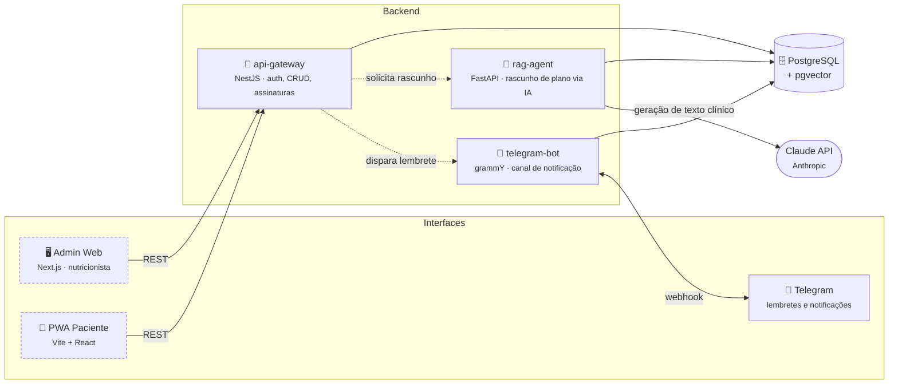

<div align="center">

# 🥗 NutriDeby

**SaaS B2B2C para nutricionistas e pacientes** — o profissional assina, o paciente usa de graça.

[](https://github.com/fabianojp06/nutrideby/actions/workflows/ci.yml)


*Operado pela WSS+13*

</div>

---

## Sobre

O NutriDeby digitaliza o consultório de nutrição: o **nutricionista** (Controladora)
gerencia prontuário, plano alimentar e cobrança recorrente pelo Admin Web; o
**paciente** (Titular) acompanha tudo pela PWA, de graça, instalada direto do
navegador do celular. Um Agente Clínico com RAG apoia a geração de rascunhos de
plano — sempre sujeitos à aprovação do nutricionista antes de chegar ao paciente.

> [!IMPORTANT]
> Todo dado de saúde é tratado sob LGPD: criptografia em repouso/trânsito, log de
> auditoria em toda operação sensível, e Termo de Consentimento obrigatório antes
> de qualquer tratamento. Ver [`docs/compliance/`](docs/compliance).

## Arquitetura



*Tracejado = app hoje conectado a dados mockados, ainda não ao backend real (ver [Status](#status-atual)).*

## Stack

| Camada | Tecnologia | Pasta |
|---|---|---|
| Admin Web | Next.js 14 · TypeScript · Tailwind · shadcn/ui | [`apps/admin-web`](apps/admin-web) |
| PWA Paciente | Vite · React · TypeScript · vite-plugin-pwa | [`apps/pwa-patient`](apps/pwa-patient) |
| API Gateway | NestJS · Prisma · JWT | [`services/api-gateway`](services/api-gateway) |
| Agente Clínico RAG | FastAPI · Anthropic (Claude) · pgvector | [`services/rag-agent`](services/rag-agent) |
| Bot de notificação | Node.js · grammY · Fastify | [`services/telegram-bot`](services/telegram-bot) |
| Banco | PostgreSQL + extensão pgvector | [`infra/docker-compose.yml`](infra/docker-compose.yml) |
| Pagamento | Asaas — Pix / cartão recorrente | — |
| CI | GitHub Actions, por pacote alterado | [`.github/workflows/ci.yml`](.github/workflows/ci.yml) |

## Estrutura do monorepo

```
nutrideby/
├── apps/
│   ├── admin-web/        dashboard do nutricionista (Next.js)
│   └── pwa-patient/      app do paciente (Vite + React)
├── services/
│   ├── api-gateway/      auth, prontuário, planos, assinaturas (NestJS)
│   ├── rag-agent/        rascunho de plano por IA (FastAPI)
│   └── telegram-bot/     lembretes e notificações (grammY)
├── infra/                docker-compose (Postgres + pgvector)
└── docs/
    ├── produto/          backlog, casos de uso, histórias de usuário
    ├── arquitetura/       arquitetura de referência
    ├── compliance/        LGPD, DPA, saneamento de documentos
    ├── negocio/           plano de negócio, propostas, concorrência
    └── mockups/           layouts HTML de referência
```

## Status atual

| Módulo | Código | Rodando |
|---|:---:|---|
| Admin Web | ✅ | 🟡 Deployado na Vercel — **dados mockados**, sem backend conectado |
| PWA Paciente | ✅ | 🟡 Deployado na Vercel — **dados mockados**, sem backend conectado |
| api-gateway | ✅ | ⚪ Implementado, ainda não hospedado |
| rag-agent | ✅ | ⚪ Implementado, ainda não hospedado |
| telegram-bot | ✅ | ⚪ Implementado, ainda não hospedado — **lançamento bloqueado** até o aditivo de DPA do Telegram ser formalizado |

Próximo passo para sair do mock: hospedar os três serviços de backend (Postgres
gerenciado + Railway/Render) e trocar `mockApi.ts` / `lib/api.ts` pelas
chamadas reais.

## Como rodar localmente

```bash
# 1. Banco (Postgres + pgvector)
cd infra && docker compose up -d

# 2. Cada pacote roda isolado — não há workspace unificado
cd apps/admin-web && npm install && npm run dev      # http://localhost:3001
cd apps/pwa-patient && npm install && npm run dev    # http://localhost:5173
cd services/api-gateway && npm install && npm run start:dev
cd services/rag-agent && pip install -r requirements.txt && uvicorn app.main:app --reload
cd services/telegram-bot && npm install && npm run dev
```

Detalhes de cada pacote, variáveis de ambiente (`.env.example`) e comandos de
migração estão no README de cada um. Deploy dos frontends: ver [`DEPLOY.md`](DEPLOY.md).

## Escopo da Fase 0 (MVP Vendável)

| Documento | Conteúdo |
|---|---|
| [`docs/produto/backlog_fase0.md`](docs/produto/backlog_fase0.md) | Backlog priorizado por sprint |
| [`docs/produto/fase0_casos_uso_historias.md`](docs/produto/fase0_casos_uso_historias.md) | 9 casos de uso, 20 histórias com critérios de aceite |
| [`docs/produto/fase0_estrutura_planos_e_backlog.md`](docs/produto/fase0_estrutura_planos_e_backlog.md) | Planos de assinatura (Starter/Pro/Clínica) |
| [`docs/arquitetura/arquitetura_tecnica_nutrideby.md`](docs/arquitetura/arquitetura_tecnica_nutrideby.md) | Arquitetura de referência (visão de longo prazo) |

## Convenções

- Commits em português, seguindo [Conventional Commits](https://www.conventionalcommits.org/) (`feat:`, `fix:`, `chore:`)
- Sem comentários desnecessários no código — documentação de "porquê", não de "o quê"
- CI roda por pacote alterado (`.github/workflows/ci.yml`) — todo PR precisa passar antes do merge

---

<div align="center">
<sub>NutriDeby · WSS+13 · privado</sub>
</div>
