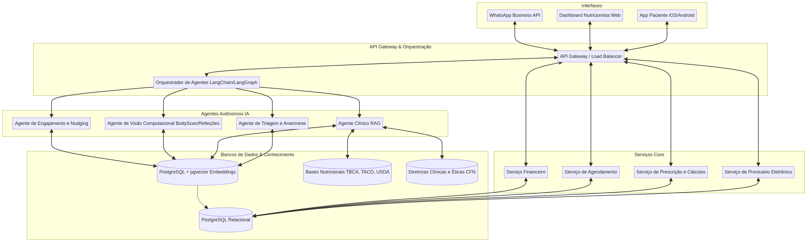

# Arquitetura Técnica Estrutural para Agentes Autônomos NutriDeby

Este documento descreve a arquitetura técnica proposta para a implementação de agentes autônomos na plataforma NutriDeby, visando otimizar a interação com nutricionistas e pacientes, além de garantir escalabilidade e conformidade com a LGPD.

## 1. Visão Geral da Arquitetura

A arquitetura é baseada em microsserviços e agentes de inteligência artificial, orquestrados por um *API Gateway* e um *Orquestrador de Agentes*. Essa estrutura permite a modularidade, escalabilidade e a fácil integração de novas funcionalidades. O diagrama a seguir ilustra a interconexão dos componentes:



## 2. Componentes da Arquitetura

### 2.1. Interfaces

As interfaces representam os pontos de contato dos usuários com a plataforma NutriDeby:

*   **App Paciente (iOS/Android)**: Aplicativo nativo para pacientes, permitindo o registro de refeições, acompanhamento de evolução, chat com o nutricionista e acesso a funcionalidades como o BodyScan.
*   **Dashboard Nutricionista (Web)**: Interface web para os profissionais de nutrição gerenciarem seus pacientes, planos alimentares, agendamentos e acessarem as ferramentas de IA.
*   **WhatsApp Business API**: Canal de comunicação oficial para envio de mensagens personalizadas, lembretes e interação com o agente conversacional.

### 2.2. API Gateway & Orquestração

Esta camada é responsável por gerenciar as requisições externas e orquestrar a execução dos agentes de IA:

*   **API Gateway / Load Balancer**: Ponto de entrada para todas as requisições externas, responsável por roteamento, autenticação, autorização e balanceamento de carga. Garante a segurança e a escalabilidade do sistema.
*   **Orquestrador de Agentes (LangChain/LangGraph)**: Componente central que gerencia o ciclo de vida dos agentes de IA. Ele recebe as requisições do API Gateway, identifica o agente apropriado para a tarefa, coordena a execução e consolida as respostas. Utiliza frameworks como LangChain ou LangGraph para definir fluxos de trabalho complexos e encadeamento de agentes.

### 2.3. Agentes Autônomos de IA

Os agentes de IA são microsserviços especializados, cada um com uma função específica no tratamento de dados e interação com usuários:

*   **Agente de Triagem e Anamnese**: Responsável por coletar informações iniciais do paciente, realizar a triagem e auxiliar na elaboração da anamnese, identificando dados relevantes para o nutricionista.
*   **Agente Clínico RAG (Retrieval Augmented Generation)**: Utiliza técnicas de RAG para gerar comunicações personalizadas, rascunhos de planos alimentares, orientações e solicitações de exames, baseando-se no prontuário do paciente e em bases de conhecimento clínico.
*   **Agente de Visão Computacional (BodyScan/Refeições)**: Processa imagens (fotos de refeições, BodyScan) para análise de composição corporal, identificação de alimentos e estimativa de porções, fornecendo dados para o nutricionista e feedback ao paciente.
*   **Agente de Engajamento e Nudging**: Responsável por enviar lembretes, orientações e 
mensagens de incentivo personalizadas, baseadas no comportamento do paciente e nas metas estabelecidas, utilizando técnicas de *nudging* para promover a adesão ao tratamento.

### 2.4. Serviços Core

Os serviços core são os microsserviços que gerenciam as funcionalidades essenciais da plataforma:

*   **Serviço de Prontuário Eletrônico**: Gerencia o armazenamento, recuperação e atualização dos prontuários dos pacientes, garantindo a segurança e a conformidade com a LGPD.
*   **Serviço de Prescrição e Cálculos**: Responsável por gerar planos alimentares, calcular necessidades nutricionais, e fornecer ferramentas para o nutricionista criar e personalizar dietas.
*   **Serviço de Agendamento**: Gerencia a agenda dos nutricionistas, permitindo o agendamento de consultas, lembretes automáticos e integração com calendários externos (ex: Google Calendar).
*   **Serviço Financeiro**: Controla o faturamento, emissão de recibos, gestão de pagamentos e relatórios financeiros para os nutricionistas.

### 2.5. Bancos de Dados & Conhecimento

Esta camada armazena todos os dados e conhecimentos necessários para o funcionamento da plataforma:

*   **(PostgreSQL Relacional)**: Banco de dados principal para armazenar dados estruturados, como informações de pacientes, nutricionistas, agendamentos, etc.
*   **(PostgreSQL + pgvector Embeddings)**: Banco de dados otimizado para armazenar *embeddings* (representações vetoriais de dados) gerados pelos modelos de IA, permitindo buscas semânticas e recuperação de informações relevantes para os agentes RAG.
*   **(Bases Nutricionais TBCA, TACO, USDA)**: Repositórios de dados nutricionais oficiais, utilizados pelo Serviço de Prescrição e Cálculos e pelos agentes de IA para garantir a precisão das informações.
*   **(Diretrizes Clínicas e Éticas CFN)**: Base de conhecimento contendo as diretrizes do Conselho Federal de Nutricionistas (CFN) e outras normas éticas e clínicas, utilizada para treinar e guiar o comportamento dos agentes de IA, garantindo a conformidade e a segurança das recomendações.

## 3. Exemplo de Código para Treinamento e Implantação de Agentes de IA

Para ilustrar a implementação de um agente autônomo, apresentamos um exemplo simplificado de um **Agente Clínico RAG** em Python, utilizando bibliotecas comuns de processamento de linguagem natural e integração com o banco de dados de *embeddings*.

```python
import openai
import psycopg2
from psycopg2.extras import RealDictCursor

# Configurações (substituir por variáveis de ambiente ou um sistema de configuração)
OPENAI_API_KEY = "sua_chave_openai"
DB_HOST = "seu_host_db"
DB_NAME = "seu_db_name"
DB_USER = "seu_db_user"
DB_PASSWORD = "sua_db_password"

class AgenteClinicoRAG:
    def __init__(self):
        self.openai_client = openai.OpenAI(api_key=OPENAI_API_KEY)
        self.conn = self._connect_db()

    def _connect_db(self):
        return psycopg2.connect(
            host=DB_HOST,
            database=DB_NAME,
            user=DB_USER,
            password=DB_PASSWORD
        )

    def _get_embedding(self, text):
        response = self.openai_client.embeddings.create(
            input=text,
            model="text-embedding-ada-002"
        )
        return response.data[0].embedding

    def _search_knowledge_base(self, query_embedding, top_k=3):
        with self.conn.cursor(cursor_factory=RealDictCursor) as cur:
            cur.execute(
                "SELECT content, source FROM knowledge_base ORDER BY embedding <-> %s LIMIT %s",
                (query_embedding, top_k)
            )
            return cur.fetchall()

    def gerar_recomendacao(self, prontuario_paciente, pergunta_nutricionista):
        # 1. Gerar embedding da pergunta do nutricionista
        query = f"Prontuário do paciente: {prontuario_paciente}. Pergunta do nutricionista: {pergunta_nutricionista}"
        query_embedding = self._get_embedding(query)

        # 2. Buscar informações relevantes na base de conhecimento (RAG)
        contextos_relevantes = self._search_knowledge_base(query_embedding)

        # 3. Construir o prompt para o LLM com o contexto
        prompt_contexto = ""
        for ctx in contextos_relevantes:
            prompt_contexto += f"\nFonte: {ctx['source']}\nConteúdo: {ctx['content']}"

        prompt = f"""
        Você é um assistente de IA para nutricionistas. Com base no prontuário do paciente e nas informações de contexto fornecidas, gere uma recomendação ou rascunho de plano alimentar. Sempre cite as fontes quando aplicável e lembre-se que a decisão final é do profissional.

        Prontuário do Paciente:
        {prontuario_paciente}

        Contexto Relevante:
        {prompt_contexto}

        Pergunta do Nutricionista:
        {pergunta_nutricionista}

        Recomendação:
        """

        # 4. Chamar o LLM para gerar a resposta
        response = self.openai_client.chat.completions.create(
            model="gpt-4", # Ou outro modelo adequado
            messages=[
                {"role": "system", "content": "Você é um assistente de IA útil para nutricionistas."},
                {"role": "user", "content": prompt}
            ]
        )
        return response.choices[0].message.content

# Exemplo de uso:
# agente = AgenteClinicoRAG()
# prontuario = "Paciente com 35 anos, sexo feminino, objetivo de perda de peso, histórico de diabetes tipo 2 na família. Dieta atual rica em carboidratos simples."
# pergunta = "Qual a melhor abordagem dietética para este paciente, considerando o histórico familiar?"
# recomendacao = agente.gerar_recomendacao(prontuario, pergunta)
# print(recomendacao)
```

## 4. Treinamento e Implantação

### 4.1. Treinamento Contínuo dos Modelos de IA

*   **Dados**: Utilização de um *pipeline* de dados para coletar interações anonimizadas (com consentimento) entre nutricionistas, pacientes e a IA, além de novas diretrizes clínicas e artigos científicos.
*   **Loop de Feedback Humano (Human-in-the-Loop)**: Implementação de mecanismos para que os nutricionistas possam avaliar e corrigir as sugestões da IA, criando um ciclo de feedback contínuo para o aprimoramento dos modelos.
*   **Fine-tuning**: Realização de *fine-tuning* periódico dos modelos de linguagem (LLMs) e de *embeddings* com dados específicos da NutriDeby e do contexto da nutrição brasileira.

### 4.2. Estratégia de Implantação (Deployment)

*   **Ambientes**: Utilização de ambientes de desenvolvimento, *staging* e produção isolados para garantir a estabilidade e a segurança das novas versões.
*   **CI/CD (Continuous Integration/Continuous Deployment)**: Implementação de um *pipeline* de CI/CD para automatizar os processos de construção, teste e implantação dos microsserviços e agentes de IA.
*   **Monitoramento**: Ferramentas de monitoramento robustas para acompanhar o desempenho dos agentes, identificar anomalias, erros e garantir a disponibilidade do sistema.
*   **Escalabilidade**: A arquitetura de microsserviços e a utilização de plataformas de orquestração (Kubernetes, por exemplo) permitem escalar os agentes e serviços de forma independente, conforme a demanda.

## 5. Considerações Finais

A implementação desta arquitetura técnica permitirá ao NutriDeby oferecer uma experiência altamente personalizada e eficiente, tanto para nutricionistas quanto para pacientes. A autonomia dos agentes de IA, combinada com a supervisão humana e a conformidade regulatória, posicionará a plataforma como uma solução inovadora e confiável no mercado de nutrição digital.
